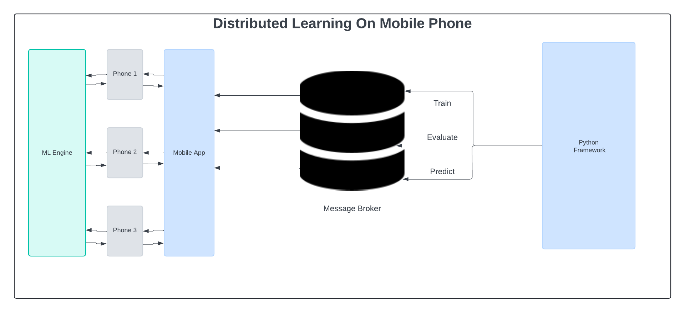

# Mobile Federated Learning

<p align="center">
  
</p>

A mobile-first framework for distributed machine learning on phones, enabling on-device training via federated learning using a Python SDK.

## Table of Contents

1. [Features](#features)
2. [Prerequisites](#prerequisites)
3. [Installation](#installation)
   - [Python SDK](#python-sdk)
   - [Mobile App (Expo)](#mobile-app-expo)
4. [Usage](#usage)
   - [Python SDK](#python-sdk-usage)
   - [React Native App](#react-native-app-usage)
5. [API Reference](#api-reference)
   - [ReceiveConfig](#receiveconfig)
   - [SendConfig](#sendconfig)
6. [Technical Considerations](#technical-considerations)
7. [Performance Notes](#performance-notes)
8. [Contributing](#contributing)
9. [License](#license)

## Features

- Distributed federated training with gradient accumulation
- Memory-efficient batch processing
- Real-time model evaluation and inference on mobile
- Automatic resource management and tensor cleanup
- Comprehensive error handling and fallback support

## Prerequisites

- Node.js (>= 14.x)
- Yarn (>= 1.x)
- Python (>= 3.7)
- expo-cli (for React Native)
- CocoaPods (for iOS dependencies)

## Installation

### Python SDK

1. Navigate to the SDK folder:
   ```bash
   cd python
   ```
2. Install in editable mode:
   ```bash
   pip install -e .
   ```

### Mobile App (Expo)

1. Install dependencies:
   ```bash
   yarn
   ```
2. Start the Expo development server:
   ```bash
   yarn start
   ```

#### iOS Setup

```bash
cd ios
pod install
cd ..
yarn
yarn start
i
```

#### Android Setup

```bash
yarn start
a
```

## Usage

### Python SDK Usage

```python
from mfl import keras, Trainer

# Define a simple model
model = keras.Sequential([
  keras.layers.Input(shape=(1,)),
  keras.layers.Dense(units=1)
])
model.compile(optimizer='sgd', loss='mean_squared_error')

# Prepare training data
inputs = [[...]]
outputs = [[...]]

# Initialize federated Trainer
trainer = Trainer(
  model,
  inputs,
  outputs,
  batch_size=2
)

# Train for 10 epochs
trainer.fit(epochs=10)
```

### React Native App Usage

```typescript
import { isAvailable, train, evaluate, predict } from './ml';

// Example training call
type ReceiveConfig = {
  modelJson: string;
  weights: string[];
  batchSize: number;
  inputs: number[][];
  inputShape: number[];
  outputs?: number[][];
  outputShape?: number[];
  epochs?: number;
};

async function runFederatedTraining(config: ReceiveConfig) {
  if (await isAvailable()) {
    const sendConfig = await train(config);
    console.log('Updated weights:', sendConfig.weights);
    console.log('Loss:', sendConfig.loss);
  } else {
    console.warn('Federated learning not available on this device.');
  }
}
```

## API Reference

### ReceiveConfig

```typescript
interface ReceiveConfig {
  modelJson: string;       // URL to the model JSON manifest
  weights: string[];       // Array of weight shard file names
  batchSize: number;       // Micro-batch size for local training
  inputs: number[][];      // Local input data array
  inputShape: number[];    // Shape of the input tensor
  outputs?: number[][];    // Local output data (for training/evaluation)
  outputShape?: number[];  // Shape of the output tensor
  epochs?: number;         // Number of local training epochs
  datasetsPerDevice?: number; // Number of batches per device
}
```

### SendConfig

```typescript
interface SendConfig {
  weights: Float32Array[]; // Updated model weights after operation
  outputs?: Float32Array[]; // Predictions (for evaluate/predict)
  loss: number;           // Loss value after training
}
```

## Technical Considerations

- **Automatic Tensor Disposal:** Prevents memory leaks by disposing of unused tensors.
- **Batch-wise Processing:** Optimizes memory usage on resource-constrained devices.
- **Error Handling:** Graceful cleanup and retry strategies on failures.
- **Background Limits:** Adheres to mobile OS restrictions for background tasks.
- **Network Optimization:** Minimizes bandwidth usage during federated communication.

## Performance Notes

- WebGL performance and model size can impact load/inference times.
- Battery consumption rises during on-device training; monitor usage.
- Network latency affects federated rounds; consider compression.
- iOS and Android hardware differences may yield variable performance.

## Contributing

Contributions are welcome! To contribute:

1. Fork the repository.
2. Create a feature branch: `git checkout -b feature/my-feature`.
3. Implement your changes and commit.
4. Push to your fork: `git push origin feature/my-feature`.
5. Open a pull request describing your changes.

## License

This project is licensed under the MIT License. See [LICENSE](LICENSE) for details.