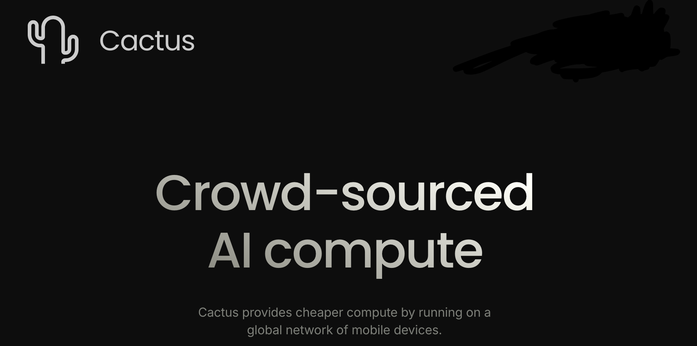
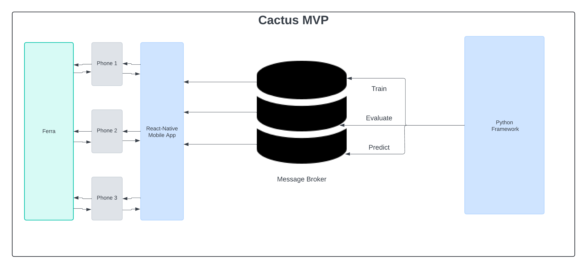

  

  

# Testing
- Clone with `git clone https://github.com/cactus-compute/mvp.git`
- Run `cd python`
- Install the package `pip install -e .`
- Then run `python test.py` (edit if necessary)

### Contribution Guidelines
- No one will be granted Admin access to the protected repo.
- Create a fork of the project in the company account.
- Git Clone the repository.
- Then CD to the sub-project you contribute to.
- Create 1 branch for every single concept.
- Commit every change independently and push.
- Once a single part is fully functional, submit a PR.
- Each task/sprint last 1-week, at the end of which each PR will be merged.
- Chunky or untested codes = rejection.
- Breaking the design patten = rejection.
- ChatGPT-generated codes = rejection. Please only use AI for reference.